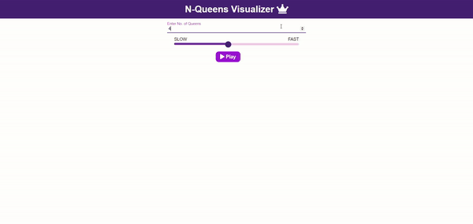

# N-Queen Visualizer

## Description

The N-Queens puzzle is the problem of placing N chess queens on an N×N chessboard so that no two queens threaten each other. This algorithm solves the puzzle using recursion and backtracking.

## Technologies Used

- React
- JavaScript
- CSS
- HTML
- chess-queens (for solving the N-Queens puzzle)
- Data-Structure (for implementing the solution algorithm)
- Visualisation

## Features

- Visualisation of the N-Queens puzzle solution.
- Uses recursion and backtracking to find all distinct solutions.

## Project Details

- Repository: [N-Queens Visualizer](https://github.com/trueaashi/N-Queens-Visualizer-.git)
- Year: 2024
- Data Structure: N-Queens Problem

## Visual Example

## How It Works

- The n-queens puzzle is the problem of placing N queens on an N x N chessboard such that no two queens attack each other.
- Given an integer N (user input), the application shows all distinct solutions to the N-queens puzzle.
- This algorithm is designed using recursion and backtracking to efficiently find and display the solutions.

## Real-Life Applications 
- Task scheduling and assignment, computer resource management, and VLSI testing.

## Getting Started

- Clone the repository: `git clone https://github.com/trueaashi/N-Queens-Visualizer-.git`
- Navigate to the project directory.
- Open `index.html` in your web browser to see the visualization.

## Contributing

- Contributions are welcome! Fork the repository and submit a pull request.
